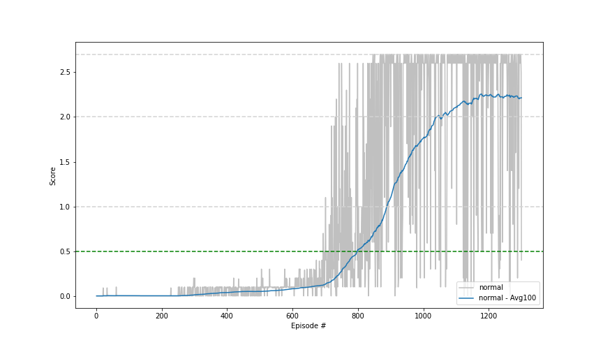
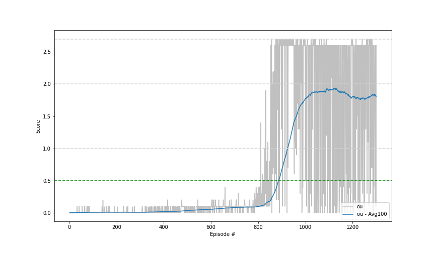
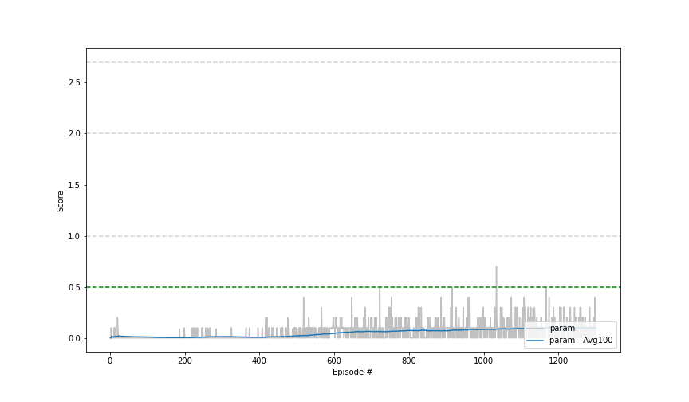
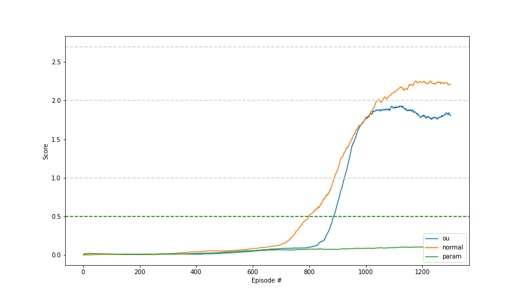

## Algorithm
I implemented a Multi-Agent Deep Deterministic Policy Gradient algorithm with shared critic. The algorithm is similar to [DDPG](https://arxiv.org/abs/1509.02971) already used in the former [project "Reacher"](https://github.com/soeren-kirchner/project2-reacher/blob/main/report.md). The difference is that every agent gets its own local observations and actions. Every agent trains and uses its own actor network and trains the shared critic network. 
The algorithm is a kind of simplification of the MADDPG described in the [paper](https://paperswithcode.com/method/maddpg) by OpenAI. In the MADDPG implementation, every agent trains its own critic with the observations of all agents. This implementation uses a shared critic that will be used and trained by all agents.

### Experience Replay
The implementation utilizes a replay buffer. On every timestep, the experiences (states, actions, rewards, next_states) of the agents will be stored in a replay buffer for later learning. After a defined amount of those timesteps a minibatch of random samples of defined size is taken from the replay buffer and used to train the networks. This gives the opportunity to learn from the past as well. This helps to stabilize the learning.

### Target Networks
Target networks are used. The target network used for the target values are time delayed copies of the regular networks. They do not change on the learning step. 
After the learning step they get a soft-update. The soft-update blends a given amount, donated by the parameter tau, of the regular network into the target network. 
The usage of target network stabilizes the learning.

### Exploration Noise
For exploration noise is added to action values. Besides the commonly used Ornstein-Uhlenbeck process noise, I tried Normal Noise and [adaptive parameter noise](https://arxiv.org/abs/1706.01905) as well. OU-Noise (Ornstein-Uhlenbeck process noise) is sampled from the Ornstein-Uhlenbeck process. 
The amount of action noise added will decrease over time to reduce exploitation 

### The Architecture of the Networks

#### A Single Actor
```
Actor(
  (seq): Sequential(
    (0): Linear(in_features=24, out_features=300, bias=True)
    (1): BatchNorm1d(300, eps=1e-05, momentum=0.1, affine=True, track_running_stats=True)
    (2): ReLU()
    (3): Linear(in_features=300, out_features=400, bias=True)
    (4): ReLU()
    (5): Linear(in_features=400, out_features=2, bias=True)
    (6): Tanh()
  )
)
```

#### Shared Critic
```
Critic(
  (seq1): Sequential(
    (0): Linear(in_features=24, out_features=300, bias=True)
    (1): BatchNorm1d(300, eps=1e-05, momentum=0.1, affine=True, track_running_stats=True)
    (2): ReLU()
  )
  (seq2): Sequential(
    (0): Linear(in_features=302, out_features=400, bias=True)
    (1): ReLU()
    (2): Linear(in_features=400, out_features=1, bias=True)
  )
)
```

## Hyperparameters
For all three kinds of adding noise, I used the same architecture and hyperparameters, except for the method-specific ones.
#### Multi Agent
```
         n_agents: 2
      random_seed: 0
      learn_every: 1
          n_learn: 8
     alpha_critic: 0.0001
       batch_size: 64
      buffer_size: 1000000
      action_size: 2
       noise_type: normal (ou, param)
       state_size: 24
```

#### Single Agent
```
       state_size: 24
      action_size: 2
       noise_type: normal (ou, param)
      alpha_actor: 0.0001
            gamma: 0.99
              tau: 0.001
 desired_distance: 0.3
           scalar: 0.5
     scalar_decay: 0.99
    normal_scalar: 0.4
```

## Results
The Normal Noise version and the OU-Noise version are solving the environment. 
Unfortunately the adaptive parameter noise gives a very bad result and does not reach the goal.

### Normal Noise
With a average score of 2.26 over 100 episodes, the version with Normal Noise gives the best result and I think a very good result.


### Ornstein-Uhlenbeck Process Noise
OU-Noise did a good job es well.  Possibly OU-Noise is just as good as Normal Noise, depending on the hyperparameters.


### Adaptive Parameter Noise
The Adaptive Parameter Noise does not work well. It does not reach the goal. I spent a lot of time trying to find out what parameters are better. In the previous project "Reacher", the Adaptive Parameter Noise was a big improvement as I described in this [article](https://medium.com/@soeren-kirchner/deep-deterministic-policy-gradient-ddpg-with-and-without-ornstein-uhlenbeck-process-e6d272adfc3), but it fails here.


### Comparison


## Ideas for Future Work
- Improving the hyperparameters
- Using a prioritized Replay Buffer
- Testing the original MADDPG algorithm described in the paper by OpenAI

